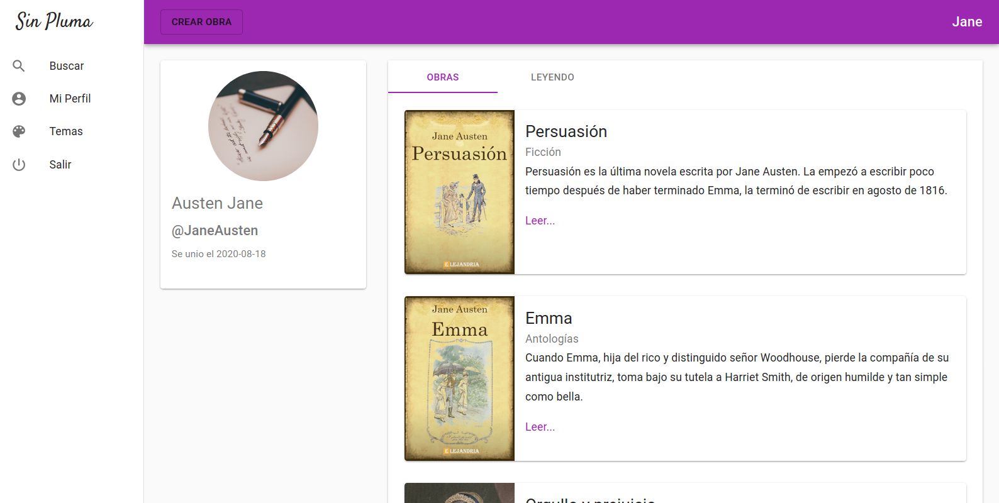

# Sin Pluma
A project designed and developed by Santiago Alberto Durán Aguilar.

# Architecture overview


The project was developed as a SaaS application using a microservices architecture. It is API first oriented, designed to be highly available, loosely coupled, and scalable.

It uses several technologies to accomplish the features previously mentioned:
- Nginx as the load balancer.
- React js for building the SPA application alongside Redux, Material UI, Slate js, React Router, Axios, and Redux Thunk.
- Flask, a Python framework, was used to build the REST API services alongside Flask-RESTful, SQLAlchemy, marshmallow.
- Redis for storing the JTI of the blocked JWT Session, as the JWT tokens have an expiration, it is cheaper to remember the blocked users rather than storing all the active ones. This breaks the statelessness principle of the REST architecture but adds more security to the system overall.
- Minio for storing the images uploaded by the user.
- InnoDB Cluster for a high available database system: InnoDB Shell, InnoDB Router, and MySQL nodes.
- Docker for containerizing the different services.
- Docker-compose for managing and running the microservices architecture in a local environment. It can start all the system by just typing the command "docker-compose up" even if the InnoDB Cluster has not been initialized or if it has a failover.

# How to execute the system
It is required to have installed docker and docker-compose in a Linux distribution. 
Lastly tested with Docker 19.03.12 and Docker Compose 1.24.1.

Add the next lines to the host file (/etc/host):

```
0.0.0.0     sinpluma.io
0.0.0.0     www.sinpluma.io
```

Execute the next command to launch the system:

```
docker-compose -f "docker-compose.yml" up -d --build
```

Launch the web application using the url mapped before.

# Changing the database

By defautl, docker compose uses "./innodbCluster/sinpluma.sql" for creating the database schema and populate the genres table, but there is another file "./innodbCluster/sinpluma.sql" that can be used to build the databse with more data.

Just change /docker-compose.yml in the volume section of inno_shell

```
inno_shell:
    ...
    volumes:
        - ...
        - ./innodbCluster/sinpluma.sql:/code.sql
```

to

```
inno_shell:
    ...
    volumes:
        - ...
        - ./innodbCluster/dump.sql:/code.sql
```

Note: The system does not recognize if there is a new change in the schema, it is needed to delete the "./innodbCluster/data" folder so the new changes can be applied.

# Screenshots


